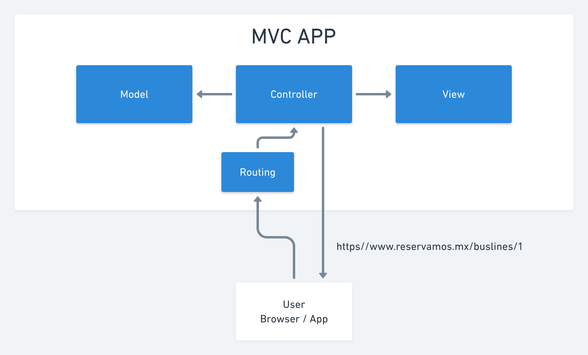

# Apprenticeship Semana 8 - Modelos y relaciones

- Clases y Objetos
  - Manual vs Cosa
  - Fabrica vs Producto
  - Práctica Pokemon
- Rails y MVC
  - Esquema de Restaurante
- Modelos
  - ORM
  - Práctica y validaciones

## Revisión de Clases y Objetos

[Archivo Ruby](./read-1.rb)

## Revisión de Rails y MVC

## Modelos

### Spotify

Artist

- Name
- Bio
- Plays
- Songs

Song

- Name
- Plays

### Shoppify

Product

- Name
- Price
- SKU

Cart

- Items

### Twitter

Tweet
  body

User
  username
